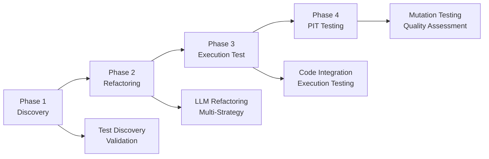

# AAA Issue Refactor Tool

<div align="center">


[](https://www.python.org/downloads/)
[](https://openai.com/)
[](LICENSE)

*Automated Java test case refactoring tool using Large Language Models to eliminate AAA pattern violations*

</div>

## 📋 Overview

AAA Issue Refactor Tool is an LLM-powered automated test refactoring tool specifically designed to detect and fix Java test case violations of the AAA (Arrange-Act-Assert) pattern. The tool supports multiple refactoring strategies and provides a complete experimental workflow for code quality improvement and research purposes.

### 🎯 Key Features

- **🔍 Intelligent Detection**: Automatically identifies 7 types of AAA pattern violations
- **🤖 LLM-Driven**: Uses OpenAI o4-mini model for intelligent refactoring
- **📊 Multi-Strategy Support**: AAA, DSL, and TestSmell refactoring strategies
- **🧪 Complete Validation**: Includes execution testing and PIT mutation testing
- **📚 Review-Friendly**: Designed for easy comparison and evaluation of refactoring results
- **💰 Cost Tracking**: Detailed LLM usage statistics and cost analysis

## 🚀 Quick Start

### Prerequisites

- Python 3.13+
- `uv` package manager
- OpenAI API Key
- Java project (Maven or Gradle)

### Installation

```bash
# Clone the repository
git clone <repository-url>
cd AAA-Issue-Refactor

# Install dependencies
uv sync

# Configure environment variables
cp .env.example .env
# Edit .env file and add your OpenAI API Key
```

### Basic Usage

```bash
# Complete refactoring pipeline
aif --project /path/to/java/project \
    --data /path/to/data/folder \
    --output /path/to/output/folder

# Refactor only (AAA strategy, auto-discovers discovery file)
aif --project /path/to/java/project \
    --data /path/to/data/folder \
    --output /path/to/output/folder \
    --refactor-only --rftype aaa

# Generate review-friendly code
aif --project /path/to/java/project \
    --data /path/to/data/folder \
    --output /path/to/output/folder \
    --show-refactored-only \
    --keep-rf-in-project

# Clean up refactored code after review
aif --project /path/to/java/project \
    --data /path/to/data/folder \
    --output /path/to/output/folder \
    --clean-refactored-only
```

### 💡 Example with Included Test Data

Using the Apache Commons CLI example data:

```bash
# Test complete pipeline
cd AAA-Issue-Refactor

# Discovery phase
uv run aif --project ./example_data_for_testing/commons-cli \
          --data ./example_data_for_testing/AAA-commons-cli \
          --output ./test_output \
          --discovery-only

# AAA strategy refactoring (auto-discovers discovery file)
uv run aif --project ./example_data_for_testing/commons-cli \
          --data ./example_data_for_testing/AAA-commons-cli \
          --output ./test_output \
          --refactor-only --rftype aaa

# Execution testing
uv run aif --project ./example_data_for_testing/commons-cli \
          --data ./example_data_for_testing/AAA-commons-cli \
          --output ./test_output \
          --execution-test-only

# Generate review-friendly code
uv run aif --project ./example_data_for_testing/commons-cli \
          --data ./example_data_for_testing/AAA-commons-cli \
          --output ./test_output \
          --show-refactored-only \
          --keep-rf-in-project

# Clean up after review (removes all refactored code)
uv run aif --project ./example_data_for_testing/commons-cli \
          --data ./example_data_for_testing/AAA-commons-cli \
          --output ./test_output \
          --clean-refactored-only
```

## 🏗️ Architecture & Workflow

### Four-Phase Pipeline



#### Phase 1: Test Discovery & Validation (`--discovery-only`)
- 📁 Load AAA results CSV and JSON context files
- ✅ Validate test cases (file existence, compilation, execution)
- 📊 Generate statistics and refactor candidates list

#### Phase 2: Intelligent Refactoring (`--refactor-only --rftype <strategy>`)
- 🤖 LLM-driven refactoring based on selected strategy
- 🔄 Iterative validation and improvement loop (max 5 rounds)
- 🧹 Code cleaning and formatting
- 💰 Detailed token usage and cost tracking

#### Phase 3: Execution Testing (`--execution-test-only`)
- 🔗 Integrate refactored code into original test classes
- ▶️ Execute refactored test methods
- ✅ Validate functional correctness
- 📈 Update results CSV

#### Phase 4: PIT Mutation Testing (`--pit-test-only --rftype <strategy>`)
- 🧬 Run PIT mutation testing
- 📊 Compare original vs refactored test quality
- 📈 Generate detailed quality improvement reports

#### Code Review Phase (`--show-refactored-only`)
- 📚 Generate review-friendly code with all strategies integrated
- 🔄 Preserve original methods unchanged
- 🏷️ Smart method naming conflict resolution
- 📝 Clear strategy block separation for easy comparison

#### Code Cleanup Phase (`--clean-refactored-only`)
- 🧹 Remove all refactored code from Java files using git checkout
- ✅ Automatically executed before Phase 3 and Phase 4 to prevent contamination
- 🔒 Safe git-based restoration to original state
- 📊 Reports which files were cleaned

## 🎯 Supported AAA Issue Types

| Issue Type | Description | Solution |
|------------|-------------|----------|
| **Multiple AAA** | Contains multiple `<arrange,act,assert>` sequences | Split into separate test methods |
| **Missing Assert** | `<arrange,act>` without assertions | Add appropriate assertions |
| **Assert Pre-condition** | `<arrange,assert,act,assert>` | Use `Assume.assumeXXX()` instead |
| **Obscure Assert** | Complex assertion logic (cyclomatic complexity > 2) | Use Hamcrest matchers or simplify |
| **Arrange & Quit** | `<arrange,if(condition)return,act,assert>` | Use Assume API for proper test skipping |
| **Multiple Acts** | `<arrange,act1,act2,...,actn,assert>` | Focus on single action per test |
| **Suppressed Exception** | `<arrange,try{act}catch{suppress},assert>` | Propagate exceptions or use `assertThrows()` |

## 🔧 Refactoring Strategies

### 1. AAA Strategy (`--rftype aaa`)
Standard Arrange-Act-Assert pattern refactoring focusing on:
- Clear three-phase structure
- Single responsibility principle
- Appropriate assertion usage

### 2. DSL Strategy (`--rftype dsl`)
Domain-Specific Language based refactoring approach:
- Higher-level abstractions
- Business domain language
- Improved readability

### 3. TestSmell Strategy (`--rftype testsmell`)
Comprehensive test smell elimination:
- Holistic test improvements
- Multiple best practices
- Code quality enhancement

## 📊 Output Files

### Discovery Phase Output
- `<project_name>_AAA_Refactor_Cases.csv`: Validated test case list

### Refactoring Phase Output
- `<project_name>_refactored_result.csv`: Wide-table format supporting multi-strategy comparison
- `<project_name>-usage.csv`: Detailed LLM usage statistics and cost analysis

### Field Descriptions

#### Common Fields
| Field | Description |
|-------|-------------|
| `project_name` | Java project name |
| `test_class_name` | Test class name |
| `test_method_name` | Test method name |
| `issue_type` | Original AAA issue type |
| `test_path` | File path |

#### Strategy-Specific Fields (per strategy)
| Field Pattern | Description |
|---------------|-------------|
| `{strategy}_refactored_test_case_code` | Refactored code |
| `{strategy}_refactored_test_case_result` | Execution result |
| `{strategy}_refactoring_cost` | OpenAI API cost (USD) |
| `{strategy}_refactoring_time` | Processing time (seconds) |
| `{strategy}_token_usage` | Token consumption |
| `{strategy}_refactoring_loop` | Iteration count |

## 📚 Review & Cleanup Workflow

### Recommended Review Workflow

1. **Generate Review Code**: Use `--show-refactored-only --keep-rf-in-project` to create review-friendly files
2. **Manual Review**: Examine the refactored methods for quality and correctness
3. **Clean Up**: Use `--clean-refactored-only` to remove all refactored code
4. **Run Tests**: Execute `--execution-test-only` or `--pit-test-only` with clean source files

### Review-Friendly Code Generation

The `--show-refactored-only` phase generates code specifically designed for easy review and comparison:

### Features
- **Non-Destructive**: Original methods are preserved unchanged
- **Strategy Separation**: Each refactoring strategy is clearly marked with visual separators
- **Smart Naming**: Automatic method renaming prevents naming conflicts
- **Import Management**: All necessary imports are automatically added
- **Immediate Compilation**: Generated code is ready to compile and run

### Example Output Format
```java
// Original method (preserved as-is)
@Test
public void testOriginalMethod() { /* original code remains unchanged */ }

/*
 * ================================================================================
 * REFACTORED METHODS FOR: testOriginalMethod
 * Original Issue Type: Multiple AAA
 * Generated by AAA Issue Refactor Tool
 * ================================================================================
 */

/*
 * --------------------------------------------------------------------------------
 * STRATEGY: AAA 
 * --------------------------------------------------------------------------------
 */
@Test
public void testOriginalMethodWithNullCase() {
    // Arrange
    String input = null;
    // Act
    boolean result = someMethod(input);
    // Assert
    assertTrue(result);
}

/*
 * --------------------------------------------------------------------------------
 * STRATEGY: DSL
 * --------------------------------------------------------------------------------
 */
@Test
public void testOriginalMethod_dsl_refactored() {
    // DSL-based refactored code...
}
```

## 💰 Cost Analysis

Based on OpenAI o4-mini official pricing:
- Input: $1.100 / 1M tokens
- Cached input: $0.275 / 1M tokens  
- Output: $4.400 / 1M tokens

### 📊 Performance Metrics

Based on Commons CLI project (10 test cases):

| Metric | AAA Strategy | Estimated DSL | Estimated TestSmell |
|--------|--------------|---------------|---------------------|
| **Avg Cost/Case** | $0.0144 | $0.018-0.025 | $0.020-0.030 |
| **Avg Time/Case** | 24.1s | 30-40s | 35-50s |
| **Avg Iterations** | 1.1 | 1.2-1.5 | 1.3-1.8 |
| **Token Usage** | 7,069/case | 8,000-10,000/case | 9,000-12,000/case |
| **Success Rate** | 100% | Est. 85-95% | Est. 80-90% |

**Cost Estimation**:
- Small projects (10-50 cases): $0.50 - $2.50
- Medium projects (50-200 cases): $2.50 - $10.00  
- Large projects (200-1000 cases): $10.00 - $50.00

## 🔧 Advanced Usage

### Debug Mode
```bash
aif --debug --keep-rf-in-project [other parameters]
```

### Custom Input File (optional)
```bash
# The tool auto-discovers discovery files, but you can specify a custom one if needed
aif --refactor-only --rftype aaa --input-file /custom/path/test_cases.csv [other parameters]
```

### Disable Auto-Update
```bash
aif --no-auto-update [other parameters]
```

## 🔧 Troubleshooting

### Common Issues

**Q: OpenAI API call failures**
```bash
# Check API key configuration
echo $OPENAI_API_KEY

# Or check .env file
cat .env | grep OPENAI_API_KEY
```

**Q: Java project compilation failures**
```bash
# Test project compilation manually
cd /path/to/java/project
mvn clean compile test-compile  # Maven projects
./gradlew compileJava compileTestJava  # Gradle projects
```

**Q: Test execution timeouts**
```bash
# Use debug mode for detailed information
aif --debug [other parameters]

# Check for infinite loops in test methods
```

**Q: Memory issues**
```bash
# Set Java memory parameters
export MAVEN_OPTS="-Xmx2g -Xms1g"
export GRADLE_OPTS="-Xmx2g -Xms1g"
```

**Q: Refactored code contaminating test results**
```bash
# Clean all refactored code before running tests
aif --project /path/to/java/project \
    --data /path/to/data/folder \
    --output /path/to/output/folder \
    --clean-refactored-only

# Manual cleanup (if git is not available)
git checkout HEAD -- *.java
```

**Q: Git repository not found**
```bash
# The cleanup function requires git. Initialize if needed:
cd /path/to/java/project
git init
git add .
git commit -m "Initial commit"
```

### Performance Optimization

1. **Batch Processing**: Processing multiple test cases at once is more efficient than individual processing
2. **Strategy Selection**: AAA strategy is typically fastest and cheapest, TestSmell is most comprehensive but time-consuming
3. **Concurrency**: Currently uses single-threading to avoid Maven conflicts
4. **Cache Utilization**: LLM leverages caching to reduce redundant computation costs
5. **Clean Workflow**: Always use `--clean-refactored-only` before execution testing to prevent code contamination
6. **Git Requirements**: Ensure Java project is a git repository for automatic cleanup functionality

## 📁 Project Structure

```
AAA-Issue-Refactor/
├── src/                    # Source code
│   ├── cli.py             # CLI entry and workflow orchestration
│   ├── discovery.py       # Test discovery and validation
│   ├── refactor.py        # LLM-driven refactoring core
│   ├── validator.py       # Code validation and integration
│   ├── executor.py        # Test execution and result recording
│   ├── llm_client.py      # OpenAI API client
│   ├── usage_tracker.py   # Usage statistics and cost tracking
│   └── utils.py          # Utility functions
├── prompts/               # LLM prompt templates
│   ├── v1-aaa/           # AAA strategy prompts
│   ├── v2-dsl-aaa/       # DSL strategy prompts
│   └── v3-testsmell/     # TestSmell strategy prompts
├── example_data_for_testing/  # Example data
└── tests/                # Unit tests
```

## 🤝 Contributing

1. Fork the project
2. Create your feature branch (`git checkout -b feature/AmazingFeature`)
3. Commit your changes (`git commit -m 'Add some AmazingFeature'`)
4. Push to the branch (`git push origin feature/AmazingFeature`)
5. Open a Pull Request

## 📄 License

This project is licensed under the MIT License - see the [LICENSE](LICENSE) file for details.

## 🙏 Acknowledgments

- OpenAI team for providing the powerful o4-mini model
- Apache Commons CLI project for providing test examples
- All contributors and users for their feedback and support

## 📞 Contact

For questions or suggestions, please contact us through:
- Create an Issue: [GitHub Issues](../../issues)
- Email: [your-email@domain.com]

---

<div align="center">
Made with ❤️ for automated test refactoring
</div>

## Features

- **Automatic Test Discovery**: Find and validate test cases with AAA pattern violations
- **LLM-Powered Refactoring**: Use state-of-the-art language models to refactor test code
- **Multiple Strategies**: Support for AAA, DSL, and Test Smell refactoring approaches
- **Execution Validation**: Automatically test refactored code to ensure functionality
- **Smart Build Management**: Hybrid build system with automatic detection and manual fallback
- **Review-Friendly Output**: Generate code for easy student review and learning
- **Comprehensive Reporting**: Detailed CSV results with usage statistics and chat histories

## Review Columns for Student Assessment

The tool now includes dedicated review columns in the output CSV files for student assessment and feedback:

### For Each Strategy (AAA, DSL, TestSmell):

#### `{strategy}_review_fix_issue_or_not`
- **Purpose**: Record whether the refactoring successfully fixed the identified AAA issue
- **Values**: 
  - `Yes` - The refactoring successfully addressed the AAA violation
  - `No` - The refactoring did not fix the issue or introduced new problems
  - `Partial` - The refactoring partially addressed the issue
  - `N/A` - Not applicable (e.g., for "Good AAA" cases)
  - (Empty) - Not yet reviewed

#### `{strategy}_review_why_fail`
- **Purpose**: Provide detailed explanation when refactoring fails or is problematic
- **Use Cases**:
  - Compilation errors in refactored code
  - Logical errors or incorrect test behavior
  - Poor code quality or style issues
  - Incomplete AAA pattern implementation
  - Missing edge cases or test coverage
  - (Empty) - Not applicable or no issues found

### Example Usage:

```csv
v1_aaa_review_fix_issue_or_not,v1_aaa_review_why_fail
"Yes",""
"No","Refactored code has compilation error - missing import statement"
"Partial","AAA pattern improved but assert section still unclear"
"N/A","Original test already follows good AAA pattern"
```

### Review Workflow:

1. **Run the complete pipeline** to generate refactored results
2. **Open the CSV file** in Excel, Google Sheets, or similar tool
3. **For each test case**, review the refactored code column
4. **Fill in the review columns** based on code quality and correctness
5. **Use the data** for grading, feedback, or research analysis
